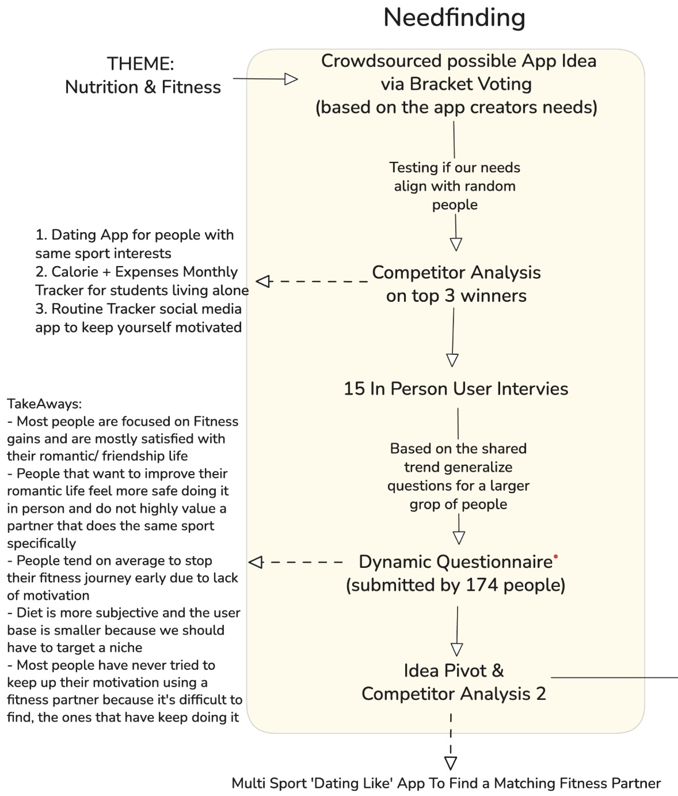

# Needfinding

  

The first part of our work, called _Needfinding_, was based on two phases:

- Interviews
- Questionnaires

With these methods, we aimed to outline the needs and possible tasks of users related to the application.

### Goal

The objective of our interviews is to obtain a comprehensive and diversified view of the needs of people in the realm of Fitness & Nutrition.
To achieve this, interviews were conducted randomly with both people our age and older, as well as people already practicing sports at high levels (football players and basketball players) and regular people.

## Interviews

The first step in needfinding is to determine questions for user interviews collected mainly in person or through a zoom call. The purpose of the interviews is to test the water and understand possible user needs to then narrow down during the questionnaire that will reach a lot more people

The questions in these interviews are asked in a generic way to avoid influencing the interviewee with our opinions. We tried to follow the principles of The Mom Test by Rob Fitzpatrick that mainly are:

1. **Talk about their life instead of your idea**

   - Focus on understanding their current behaviors and experiences
   - Avoid leading questions about your solution
   - Let them tell their story naturally

2. **Ask about specific past behaviors**

   - "What was the last time you tried to find a workout partner?"
   - "How did you handle that situation?"
   - Avoid hypothetical questions about future actions

3. **Listen for concrete facts and actions**

   - Look for specific examples and real experiences
   - Avoid taking general statements at face value
   - Dig deeper when answers are vague

4. **Ask for numbers and specifics**

   - "How often do you work out?"
   - "How many times have you tried to find a training partner?"
   - Get quantifiable data when possible

5. **Look for emotional signals**
   - Pay attention to their tone and enthusiasm
   - Notice what problems they get excited about
   - Identify their real pain points

### Procedure

The procedure by which we conducted the interviews is based on the following steps drawn up by Robson and McCartan (2016):

1. An introduction in which the interviewer introduces themselves and explains why they are doing the interview, reassures interviewees regarding any ethical issues, and asks if they mind being recorded, if appropriate. This should be exactly the same for each interviewee.

2. A warm-up session where easy, non-threatening questions come first. These may include questions about demographic information, such as "What area of the country do you live in?"

3. A main session in which the questions are presented in a logical sequence, with the more probing ones at the end. In a semi-structured interview, the order of questions may vary between participants, depending on the course of the conversation, how much probing is done, and what seems more natural.

4. A cooling-off period consisting of a few easy questions (to defuse any tension that may have arisen).

5. A closing session in which the interviewer thanks the interviewee and switches off the recorder or puts their notebook away, signaling that the interview has ended.

## Questionnaire

To better understand the preferences, habits, and expectations of our target users, we designed and distributed a custom-made (Next.js) questionnaire focused on three key themes. The questionnaire was designed to be adaptive, with questions being presented to users only if they were actively trying to improve that particular area of their life. This approach helped us focus on potential users who were genuinely interested in our app's core features:

- **Fitness habits**
- **Social and relationship dynamics (friendship/dating/training groups)**
- **Diet**

In order to maximize participation and engagement, we decided to include a playful and unconventional reward at the end of the survey: a personalized "insult" generated by an AI based on the user's answers. This idea was inspired by the popularity of humorous, AI-generated content that often goes viral among younger audiences — the core demographic we aimed to reach with our application (87.4% of them are 18–30 years old).

To ensure responses were as objective and reliable as possible, we deliberately limited the questionnaire to questions about users' past behaviors and experiences, avoiding those related to future intentions or hypothetical scenarios. This approach proved to be effective, and we collected a total of **174 responses**, providing us with a rich set of data to analyze user needs and validate the direction of our project.

[You can take the Quesionnaire by clicking here](https://hci-service.vercel.app/form/fitm8)

## Findings

### Key Insights from the Interviews

- **Training alone is common, but unsatisfying.** Many students reported working out alone, often due to a lack of alternatives or difficulty finding a partner to share their routine with. Nonetheless, several expressed a desire to train with others to boost motivation and make physical activity more enjoyable.
- **Consistency and motivation are recurring challenges.** Those who train alone frequently struggle with waning motivation caused by boredom or lack of external stimulation. Having a workout partner or small group was seen as a key factor in maintaining commitment over time.
- **Physical activity is also viewed as a social opportunity.** Activities such as running, gym workouts, functional training, or team sports were perceived as spaces for interaction and exchange—more natural than purely digital social contexts. While some participants shared positive experiences of finding groups through social media, others found it difficult to integrate into new sports communities after relocating.
- **Diet matters, but it's not central when choosing workout partners.** Even those who follow strict dietary habits prefer matches to be based on shared fitness interests rather than eating habits, which were seen as more personal or private.
- **Interest in a dating component is limited.** Many participants expressed skepticism toward integrating romantic features into a sport-related context. Instead, there was strong interest in a neutral space focused on building authentic connections based on shared goals, allowing relationships to evolve naturally over time.
- **Openness to tools that connect people through sport.** The idea of an app that helps users find workout partners was met with enthusiasm. The most appreciated features included the ability to filter by type of activity, skill level, time, and location—with the goal of helping users form compatible pairs or small groups.

Based on the responses collected through our questionnaire, we began to identify the key needs expressed by young users interested in fitness and well-being — particularly those aged 18 to 30, who represented 87.4% of respondents.

### Key Insights from the Questionnaire

#### Training Habits & Motivation

One of the most prominent issues that emerged was the difficulty in finding workout partners:

- A majority of users (62.2%) tend to train alone
- Only a small portion have regular training companions
- When users do find a partner, it's usually through unstructured or spontaneous encounters

Another recurring theme was the loss of motivation, mainly due to:

- Boredom (81%)
- Lack of visible progress
- The sense that working out alone is less stimulating and rewarding

#### Social Needs & Group Activities

Users expressed a clear desire to enhance their social life through meaningful, shared experiences:

- Group physical activity was one of the most appreciated contexts
- Many preferred exercising with others over other forms of social interaction, especially purely digital or random ones
- There's a widespread need to easily discover and join group workouts, with clear, accessible information about:
  - Location
  - Time
  - Activity type
  - Required fitness level

#### Dating vs. Friendship: A Key Design Decision

A critical insight emerged regarding romantic versus platonic connections. While we initially explored the possibility of incorporating dating elements, the data made it clear that this direction would not align with most users' expectations:

- 66.3% of respondents have never used dating apps
- Among them, the top reasons included:
  - Preference for offline interactions (66.7%)
  - Feeling that dating apps don't feel natural (54.4%)
- Many users shared a sense of frustration with current dating platforms
- Users expressed a stronger interest in meeting people through shared interests, without romantic pressure

As a result, we made a deliberate decision to focus the app on friendship and community-building through fitness — rather than on dating. The goal is to offer a safe, casual, and inclusive environment where users can connect over common wellness goals and form lasting connections without the constraints or expectations typical of dating apps.

#### Narrowing the Scope: Why We Chose Running

To maintain focus and maximize user engagement, we decided to concentrate on a single sport: running.

This decision was based on direct feedback from user interviews, where running consistently emerged as one of the most practiced and accessible physical activities among our target demographic.

By focusing on running, we are able to design a more tailored experience — from event creation to partner matching — that directly addresses users' habits and preferences, while simplifying the onboarding process for new users.
