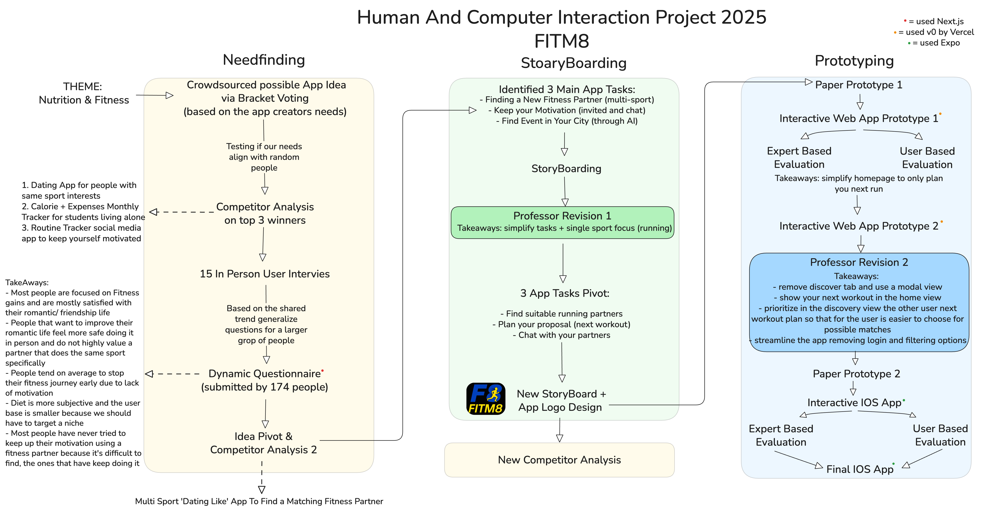
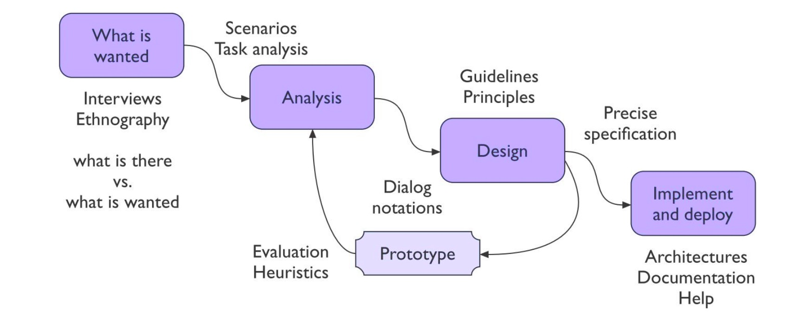

# FITM8

## Plan your next workout and let others join, find and join exciting runs near you, and connect through group chats or one-on-one conversations. Keep your motivation UP↑ with a community that shares your passion for running! 🏃🏻‍♂️💨

Project related to the examination of _Human Computer Interaction_ of the academic year 2025/2026 by the
_FITM8_ Team - La Sapienza University. The project is organized by the following students:

- **Zamparelli Fausto** $|$ GitHub Profile: [faustozamparelli](https://github.com/faustozamparelli)
- **FarinolaDaniele** $|$ GitHub Profile: [danifari](https://github.com/danifari)
- **Falbo Mario Daniel** $|$ GitHub Profile: [danielfalbo](https://github.com/danielfalbo)
- **Maatkulov Beksultan** $|$ GitHub Profile: [Thebeks312](https://github.com/Thebeks312)
- **Pompei Chiara** $|$ GitHub Profile: [ChiaraNwk](https://github.com/ChiaraNwk)
- **Melis Zhorobaev** $|$ GitHub Profile: [Melo5en](https://github.com/Melo5en)

The theme for the app design process this year was: **Fitness & Nutrition**

# How did we work?

  

## Human-Centered Design Process

The procedure we were inspired to create the digital prototype is the Human-Centered Design Process:

1. **Needfinding**
   - What exactly is needed? How are people currently accomplishing the goal?
   - User observation, interviews, questionnaire
2. **Analysis**
   - Formalize and structure the needs
   - Create interaction scenarios, stories, tasks
   - Compare current situation with expected new situation
3. **Design**
   - Rules, guidelines, design principles
   - Modeling and describing interaction
   - Visual layout
   - Consider all inputs from cognitive models, communications theories, organization issues
4. **Iteration and prototyping**
   - Design must be supported by intermediate verification
   - Evaluate the design in its partial forms: Prototypes and Evaluation metrics
   - Involving users
5. **Implementation and deployment**
   - Hardware and software implementation
   - Documentation

  

## Procedure

The basic steps of creating the digital prototype are as follows, click to see the folders material:

1. [Needfinding](/Needfining-Interviews-Questionaires)
2. [Storyboarding](/StoryBoarding)
3. [Paper ProtoTyping](/PaperPrototypes)
4. [Digital ProtoTyping](/DigitalPrototypes)

# Final Results and Testing

## Testing 1: Plan your new workout, joinable by future runners.

### Task

1. Open the Create New Run pane
2. Fill in the informations about your run
3. Scroll through your next workouts card in the home page

### Scenario

You're a regular runner who wants to plan a 5K run in Villa Borghese next Saturday morning. You'd like to invite other runners to join you for motivation and company. Use the app to create a new workout event and share it with the community.

## Testing 2: Find a suitable partner you would like to join on a run

### Task

1. Open the Discover modal view
2. Check out the other runnner profile card with his next workout plan
3. Swipe left/right based on your interest

### Scenario

You're looking for a running partner who matches your pace and schedule. You prefer morning runs around 7 AM and can maintain a 5:30 min/km pace. Use the app to find and connect with compatible runners in your area.

## Testing 3: Chat with your future running partner/group

### Task

1. Open the chat tab
2. Scroll through your workouts and other workouts joined events
3. Open a chat, write a message
4. See the runners that are in the group
5. If you are the creator of the run event edit the details

### Scenario

You've joined a group run for a 10K training session in Villa Ada this weekend. Use the app to see who is joining and coordinate with other participants about meeting points, pace expectations, and any last-minute changes to the plan.
