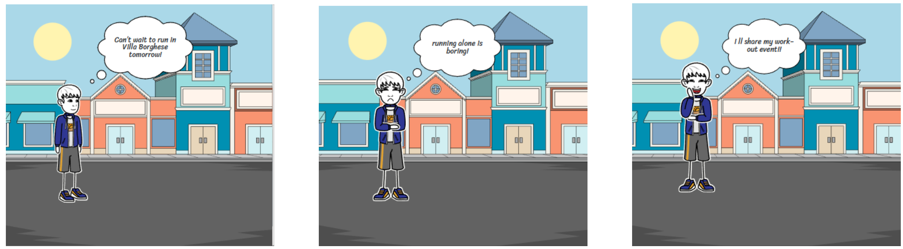
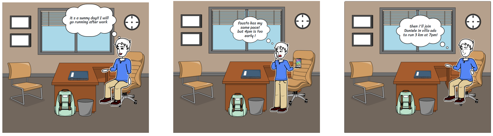
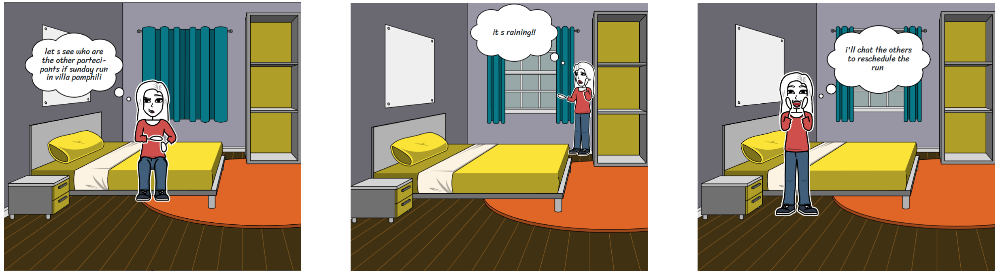

# StoryBoarding

  

This section presents the storyboard for three main tasks in the FitM8 application.
Each task is represented visually with a sequence of screens that illustrate the user’s
main interactions.

## Task 1: plan your workout,joinable by future runners

The user creates a new running workout that is visible to others.

  

Scenario:
You're a regular runner who wants to plan a 5K run in Villa Borghese next Saturday morning. You'd like to invite other runners to join you for motivation and company. Use the app to create a new workout event and share it with the community.

## Task 2: find a suitable partner to join a run

The user searches for a running partner with compatible preferences and habits.

  

Scenario:
You're looking for a running partner who matches your pace and schedule but you got work to finish! You prefer a 7pm run with a 5:30 min/km pace, you usually run with Fausto but today he will run at 4pm. Use the app to find and connect with Daniele that will do 3km at your preferred pace and time.

## Task 3: Communicating with the Partner or Group

The user communicates with a running partner or group to coordinate workout details

  

Scenario:
You've joined a group run for a 10K training session in Villa Pamphili this Sunday, buth the weather app says that it will be raning... Use the app to see who is joining and coordinate with other participants about a possible reschedule.

#### Older StoaryBoarding
The older storyboards are found here:

1. [Original Idea](./StoryBoards/OldStoryBoard.pdf)
2. [Paper Sketch of the New Idea](./StoryBoards/PaperSketch.jpeg)
